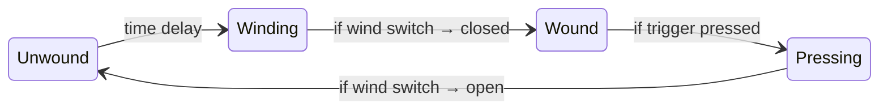

# Camera State Diagram

```mermaid
stateDiagram-v2
direction LR

Unwound --> Winding  : time delay
Winding --> Wound    : if wind switch → closed
Wound --> Pressing   : if trigger pressed
Pressing --> Unwound : if wind switch → open
```

State|Action
-|-
Unwound     | Move shutter servo home, wait
Winding     | Spin wind servo
Wound       | Stop wind servo
Pressing    | Move shutter servo in increments
